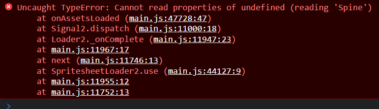
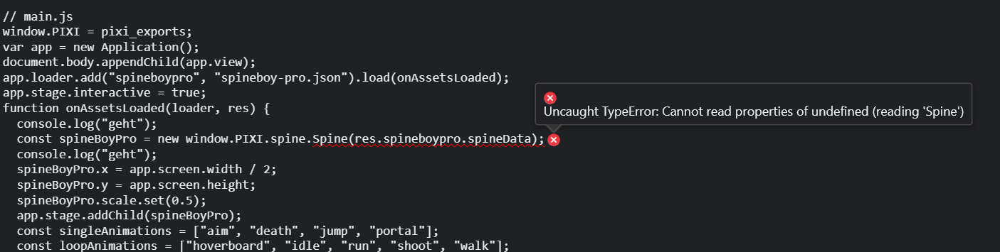

# Testing pixi.js + pixi-spine + esbuild

Following [the pixi.js example](https://pixijs.io/examples/?v=dev#/plugin-spine/spineboy-pro.js) to display a Spine2D sprite does not function.

## Error I'm seeing





The error I'm currently getting is that PIXI.spine is not available.
I think that I'm not including it correctly, or that esbuild is stripping it out?

```js
function onAssetsLoaded(loader, res) {
	// create a spine boy
	const spineBoyPro = new PIXI.spine.Spine(res.spineboypro.spineData);
	                            // ^ not finding this 
```

I have also tried it using parcel with similar results (there's an issue about it [here](https://github.com/pixijs/spine/issues/297).

## Building dist

I'm building the `dist` directory like this and have included it here for brevity:

```
node_modules\.bin\esbuild --bundle main.js --servedir=dist --outdir=dist
``` 